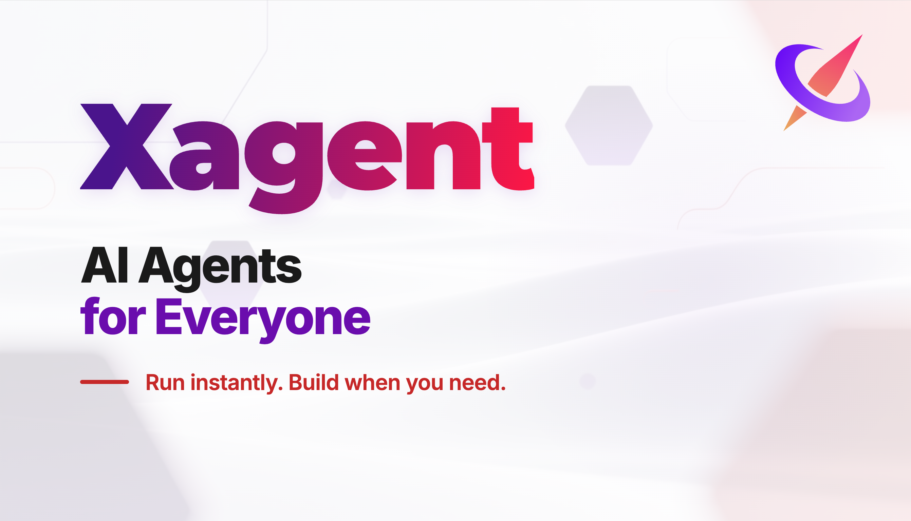

---

## What is Xagent?

Xagent is a production-ready AI Agent platform that helps teams build, deploy, and scale intelligent systems — without designing rigid workflows.

It combines:

* 🧠 Dynamic planning engine
* 🔧 Tool & model orchestration
* 📊 Execution tracking & observability
* 🏢 Enterprise-grade deployment

If you're building AI copilots, vertical AI products, or internal automation systems — Xagent is your foundation.

---

## 🧩 What You Can Build

With Xagent, you don’t design workflows.
You describe the task.

That’s it.

No complex orchestration logic.
No specialized workflow expertise.
No brittle flow diagrams.

Just define what you want done — and Xagent plans, decomposes, selects tools, and executes.

You can build:

* Automated PPT generation & structured slide decks
* Deep analysis reports & research summaries
* Marketing posters & creative design assets
* AI copilots for internal teams
* Enterprise knowledge assistants
* Data & reporting automation systems
* AI-powered SaaS features
* Multi-step reasoning systems across tools
* High-volume enterprise task automation (simple but repetitive workflows)

If you can clearly describe the goal,
Xagent can turn it into an executable system.

All powered by one unified runtime.

---

## 🚀 Quick Start

### 1️⃣ Clone the repository

```bash
git clone https://github.com/xorbitsai/xagent.git
cd xagent
cp example.env .env
```

### 2️⃣ Start with Docker Compose

```bash
docker compose up -d
```

### 3️⃣ Open in browser

```
http://localhost:80
```

**Default administrator credentials:**
- Username: `administrator`
- Password: `administrator`

That's it. Xagent is now running.

---

## ✨ Core Features

### 🧠 Dynamic Planning Engine

Unlike traditional workflow tools, Xagent plans tasks dynamically at runtime.

* Automatic task decomposition
* Plan → Execute → Reflect loops
* Conditional branching
* Multi-step reasoning

No static flows. No brittle chains.

---

### 🔌 Tool & Model Orchestration

Xagent connects to your entire stack:

* OpenAI, Anthropic and other LLM providers
* Self-hosted models via Xinference
* External APIs
* Knowledge bases (RAG)
* Internal enterprise systems

It selects and orchestrates tools automatically during execution.

---

### ⚡ Instant Execution Mode

For simple use cases, run tool-enabled LLM calls instantly.

* No configuration overhead
* Chat-style assistants
* Embedded AI features

Start simple. Scale when needed.

---

### 📊 Observability & Control

Built for real production use:

* Task lifecycle tracking
* Token usage monitoring
* Execution state management
* Multi-user support

Operate agents like real systems — not demos.

---

## 🏢 Deployment Options

Xagent supports:

* Self-hosted deployment
* Private cloud environments
* On-premise enterprise infrastructure
* Docker-based setup

You control your models, data, and infrastructure.

---

## 🏗 Architecture Overview

Xagent separates core responsibilities:

* **Agent Definition** – intent & constraints
* **Planning Engine** – dynamic decomposition
* **Execution Runtime** – orchestration layer
* **Tool Layer** – integrations & actions
* **Model Layer** – LLM & inference backend

This architecture enables:

* Stability under complex reasoning
* Safe iteration
* Horizontal scalability
* Long-term maintainability

---

## 🤝 Contributing

We welcome developers, product builders, and researchers.

Open issues. Submit PRs. Help shape the future of AI agents.

---

## 📄 License

This project is licensed under the Xagent Source License - see the [LICENSE](LICENSE) file for details.
